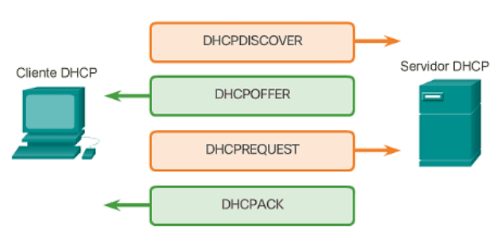

# El protocolo DHCP
## Introducción
El **DHCP** (Dynamic Host Configuration Protocol), o Protocolo de Configuración Dinámica de Equipos, es un estándar fundamental en redes que permite a los dispositivos obtener automáticamente los parámetros necesarios para comunicarse. Gracias a este protocolo, no es necesario configurar manualmente cada equipo, lo que simplifica enormemente la administración de redes, especialmente en entornos con muchos dispositivos. Su RFC es el [2131](https://www.rfc-editor.org/rfc/rfc2131).

El funcionamiento del servicio DHCP se basa en dos componentes principales. Por un lado, el **servidor** DHCP, que es el encargado de asignar las configuraciones a los dispositivos de la red. Este servidor gestiona un conjunto de direcciones IP disponibles, conocido como pool de direcciones, y lleva un registro detallado de qué configuración ha sido asignada a cada equipo, así como el tiempo durante el cual esa asignación es válida. Por otro lado, está el **cliente DHCP**, que es cualquier dispositivo (como un ordenador, móvil o impresora) que solicita automáticamente una configuración al servidor para poder conectarse y comunicarse dentro de la red.

Desde el punto de vista técnico, DHCP utiliza habitualmente el protocolo de transporte UDP, aunque está diseñado para poder funcionar también con TCP. En la práctica, las solicitudes de los clientes se envían desde el *puerto 68* y se dirigen al *puerto 67* del servidor, donde son procesadas.

Cuando el servidor DHCP asigna una configuración a un cliente, proporciona varios parámetros esenciales:
- Dirección IP y Máscara de red. 
- Puerta de enlace (Gateway). 
- Direcciones IP de los servidores DNS. 
- Fecha y hora de concesión (cuándo se entregó la configuración). 
- Fecha y hora de caducidad (cuándo expira el permiso de uso de esa IP).
## Tipos de asignación
### Asignación Manual
Es el administrador de la red quien asigna la dirección IP directamente; en este proceso no interviene el servicio DHCP
| Ventajas | Inconvenientes |
|:----------:|:--------:|
|Es un método útil para redes que cuentan con muy pocos equipos, lo que permite controlarlos de forma sencilla | El administrador tiene la responsabilidad de recordar qué direcciones están libres u ocupadas|
| | Hay una mayor posibilidad de errores en la configuración |
| | Supone un trabajo extra considerable si la red se amplía |
### Asignación Automática
La dirección IP es asignada por el servidor DHCP, simplificando la gestión de la red al automatizar el proceso
## Mensajes DHCP
### Proceso de Asignación Inicial
Cuando un equipo se conecta a la red y necesita una configuración, sigue estos pasos:
1. DISCOVER (Descubrimiento): El cliente envía un mensaje por difusión (broadcast) a toda la red para detectar servidores DHCP activos. Este mensaje incluye la dirección MAC del cliente para que los servidores sepan a quién responder
2. OFFER (Oferta): Los servidores que reciben la petición responden con un mensaje que contiene una oferta de configuración (IP, máscara, etc.)
3. Selección: El cliente analiza las ofertas recibidas y selecciona la primera que sea válida
4. REQUEST (Solicitud): El cliente envía nuevamente un mensaje por difusión indicando qué oferta ha aceptado. Esto sirve para confirmar al servidor elegido y para que los demás servidores descarten sus ofrecimientos
5. ACK (Reconocimiento): El servidor seleccionado registra la asignación y envía un mensaje ACK al cliente con los parámetros finales de configuración
6. Configuración final: El cliente recibe el mensaje y queda configurado para operar en la red

### Renovación de la concesión
Como las direcciones IP suelen asignarse por un tiempo limitado (concesión), el cliente debe gestionarlas:
1. RENEW (Renovación): Cuando se supera la mitad del plazo concedido (50%), el cliente envía un mensaje al servidor para solicitar una ampliación del tiempo
2. Fallo de renovación (NAK): Si no se logra renegociar y se llega al 87,5% del tiempo, y el servidor no puede renovar la dirección, enviará un mensaje NAK indicando que el contrato ha finalizado
### Reinicio del cliente
- Reinicio del cliente: Para ahorrar tiempo, si un equipo se reinicia, envía directamente un REQUEST en lugar de empezar con un DISCOVER
- Autoconfiguración (APIPA): Si tras 4 intentos de envío de un mensaje DISCOVER el cliente no recibe respuesta de ningún servidor, este se asigna automáticamente una dirección IP del tipo 169.x.x.x
- DECLINE: El cliente envía este mensaje si detecta que la IP que le ha ofrecido el servidor ya está siendo usada por otro equipo (por ejemplo, por una asignación manual previa)
- RELEASE (Liberación): Cuando el cliente ya no necesita la dirección IP (por ejemplo, al apagarse de forma ordenada), envía este mensaje al servidor para liberar la IP y que pueda ser usada por otro equipo
